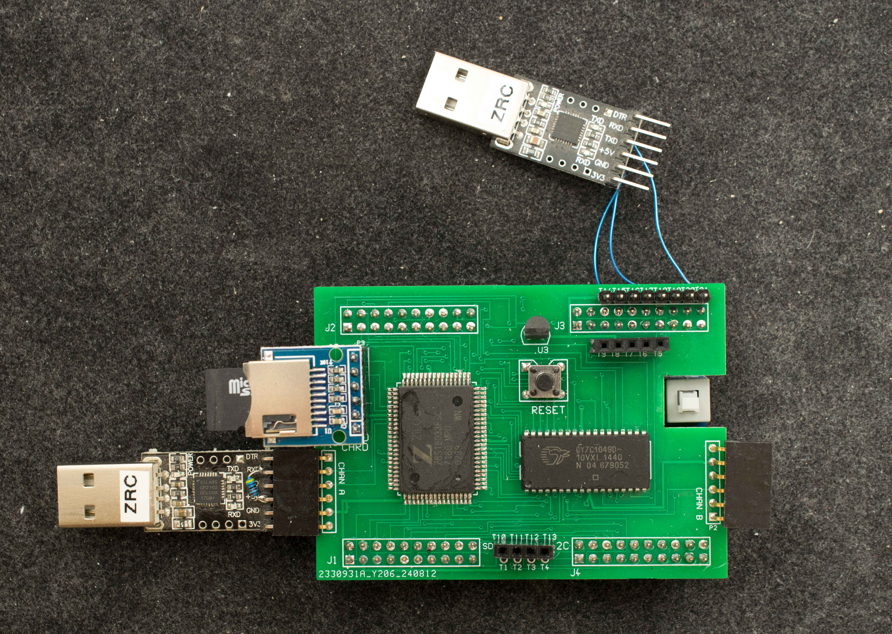

# 3V Z180 Rev0 Mezzanine Board for EPM240 Dev Board
### Introduction
Z8S180 is rated for 3.3V operation at 20MHz nominal. The 3VZ180 mezzanine board is designed for RomWBW. While its nominal operating frequency is 16.7MHz, It has been overclocked to 64MHz. A 50MHz design file is included along with the nominal 16.7MHz design files.

### Features
- Z8S180
- 512K RAM
- 512 byte flash embedded in EPM240
- ACIA emulation in EPM240
- SD card interface
- RTC module based on DS1302
- I2C interface
- Designed for RomWBW
### Theory of Operation
### Design Files
- Schematic
- Gerber photoplots
- CPLD design files
- Bill of Materials

### Software
### 3VZ180 Projects
Overclock 3VZ180
Discussion in retrobrewcomputers about [overclocking 3VZ180](https://www.retrobrewcomputers.org/forum/index.php?t=msg&th=810&goto=10835&#msg_10835)

3VZ180 RomWBW is successful
